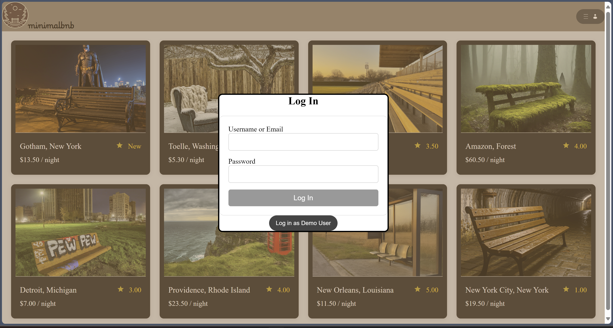
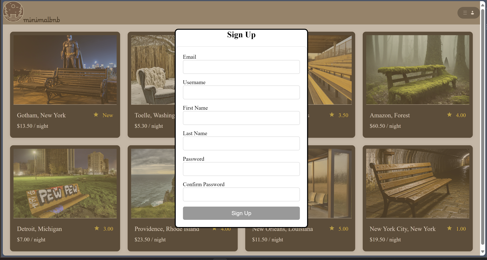
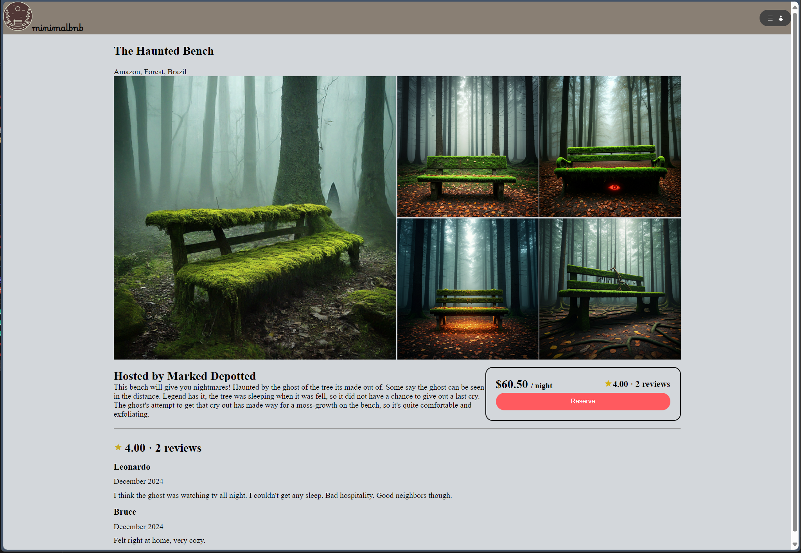
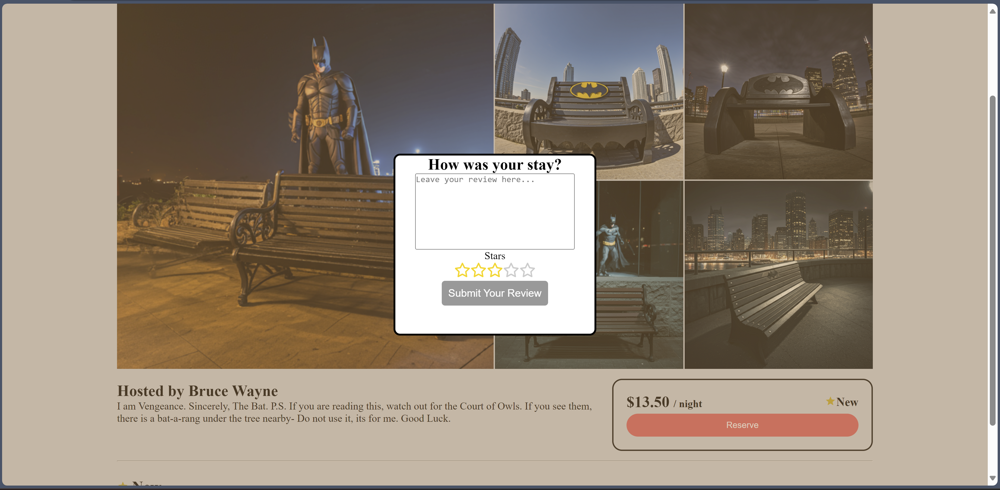
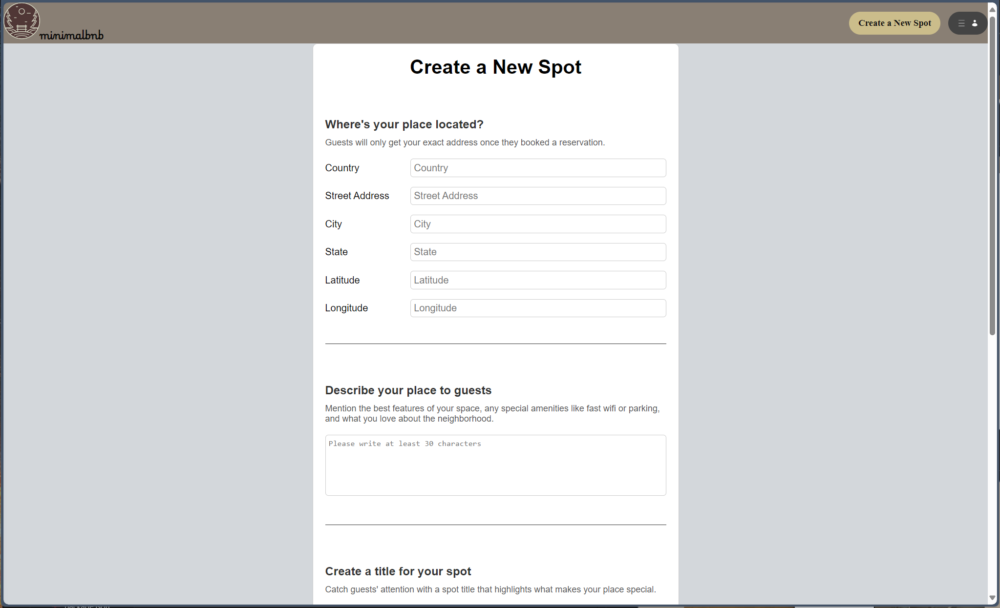
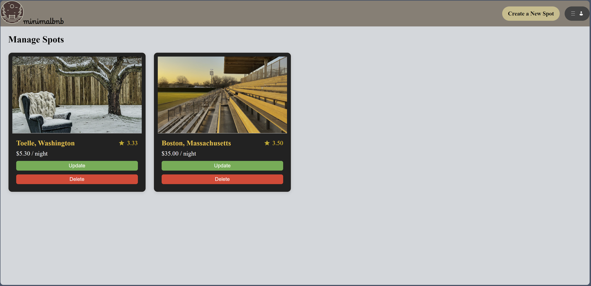

# minimalb&b
Live Link: [minimalb&b](https://minimalbnb.zevb.dev)

Experience the world differently with a selection of peculiar accommodations.
My first ever production-level deployed application.

# Frontend Technologies Used

# Backend Technologies Used

## [Feature List](https://github.com/zev-b/minimalbnb/wiki/Feature-List)
List of application features.

## [Database Schema](https://github.com/zev-b/minimalbnb/wiki/Database-Schema)
A visualization of the relationship between data.

# Splash / Home Page

# Log In

# Sign Up

# Spot Details Page

# Post Review Modal

# Create a Spot Page

# Manage Spots Page
